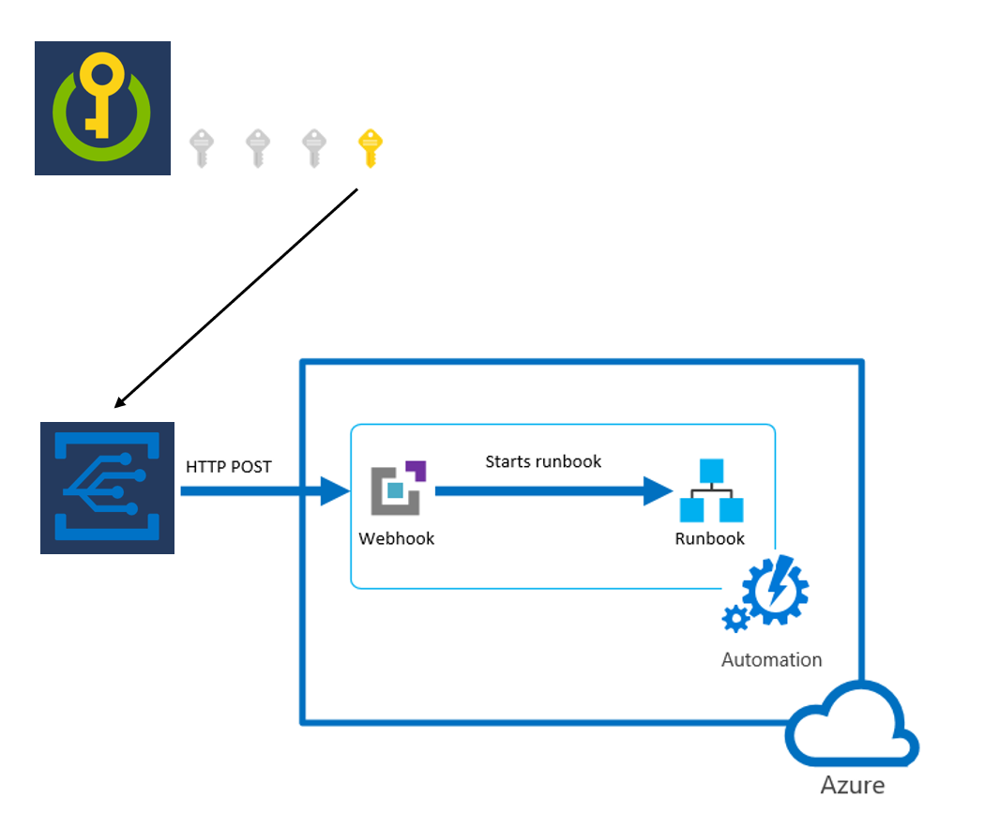

# terraform-azurerm-automation-runbook-app-secret-rotation
Terraform module to deploy an azure runbook for rotating azure application client secrets, triggered from keyvault expired secret grid events.
and configarable with tags on azure keyvault secrets/

### High Level Design



1. an automation account with a runbook is deployed with a webhook trigger
2. an event grid subscription is deployed for keyvault expired secret events and
   new secret version created event to create the initial secret
3. to use the auto rotation a keyvault secret needs to be created with the required tags
4. the keyvault needs to be added to this modules keyvault subscriptions var
5. the automation account needs to have the required permissions to the keyvault for updating the secret and chaning the ip firewall rules

### Usage/keyvault secret tags

the azure keyvault secret can be configured to autorotate with the following tags

```
    "az_aa_client_secret_rotation.app_name"                   = "AZURE_APPLICATION_NAME_TO_ROTATE_CLIENT_SECRET"
    "az_aa_client_secret_rotation.client_secret_display_name" = "auto_rotated_client_secret"
    "az_aa_client_secret_rotation.enabled"                    = "true"
    "az_aa_client_secret_rotation.expiration_in_days"         = "90"
```

to cleanup  client secrets from an application the following tag can be used:

```
"az_aa_client_secret_rotation.delete_client_secret" = "true"
```


<!-- BEGIN_TF_DOCS -->
## Requirements

| Name | Version |
|------|---------|
| <a name="requirement_azurerm"></a> [azurerm](#requirement\_azurerm) | ~> 4.0 |

## Providers

| Name | Version |
|------|---------|
| <a name="provider_azuread"></a> [azuread](#provider\_azuread) | n/a |

## Modules

| Name | Source | Version |
|------|--------|---------|
| <a name="module_automation_account"></a> [automation\_account](#module\_automation\_account) | cloudnationhq/aa/azure | ~> 2.6 |
| <a name="module_eventgrid"></a> [eventgrid](#module\_eventgrid) | cloudnationhq/eg/azure | ~> 1.4 |
| <a name="module_naming"></a> [naming](#module\_naming) | CloudNationHQ/naming/azure | ~> 0.23 |
| <a name="module_runbooks"></a> [runbooks](#module\_runbooks) | cloudnationhq/aa/azure//modules/runbooks | ~> 2.6 |

## Resources

| Name | Type |
|------|------|
| [azuread_app_role_assignment.app_role_assignment](https://registry.terraform.io/providers/hashicorp/azuread/latest/docs/resources/app_role_assignment) | resource |
| [azuread_application_published_app_ids.well_known](https://registry.terraform.io/providers/hashicorp/azuread/latest/docs/data-sources/application_published_app_ids) | data source |
| [azuread_service_principal.msgraph](https://registry.terraform.io/providers/hashicorp/azuread/latest/docs/data-sources/service_principal) | data source |

## Inputs

| Name | Description | Type | Default | Required |
|------|-------------|------|---------|:--------:|
| <a name="input_environment"></a> [environment](#input\_environment) | environment | `string` | n/a | yes |
| <a name="input_keyvaults"></a> [keyvaults](#input\_keyvaults) | list of keyvaults to add to the eventgrid subscription | <pre>list(object({<br/>    name = string<br/>    id   = string<br/>  }))</pre> | `[]` | no |
| <a name="input_location"></a> [location](#input\_location) | location code | `string` | n/a | yes |
| <a name="input_location_code"></a> [location\_code](#input\_location\_code) | location code | `string` | n/a | yes |
| <a name="input_name_suffix"></a> [name\_suffix](#input\_name\_suffix) | name suffix | `string` | `"asr-rb"` | no |
| <a name="input_resource_group_id"></a> [resource\_group\_id](#input\_resource\_group\_id) | resource group id | `string` | n/a | yes |
| <a name="input_resource_group_name"></a> [resource\_group\_name](#input\_resource\_group\_name) | resource group name | `string` | n/a | yes |
| <a name="input_tags"></a> [tags](#input\_tags) | tags | `map(string)` | `{}` | no |
| <a name="input_webhook_expiration_end_year"></a> [webhook\_expiration\_end\_year](#input\_webhook\_expiration\_end\_year) | webhook expiration in years | `number` | `2027` | no |
| <a name="input_workload"></a> [workload](#input\_workload) | workload | `string` | n/a | yes |

## Outputs

| Name | Description |
|------|-------------|
| <a name="output_automation_account_name"></a> [automation\_account\_name](#output\_automation\_account\_name) | automation account |
| <a name="output_webhook_endpoint"></a> [webhook\_endpoint](#output\_webhook\_endpoint) | webhook url for the runbook to receive the keyvault grid events |
<!-- END_TF_DOCS -->

### references
https://learn.microsoft.com/en-us/azure/key-vault/general/event-grid-tutorial
